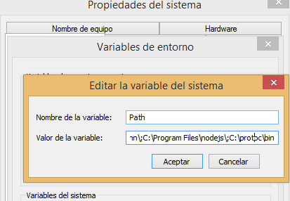

# protocolbuffers-practice
First practice

# Version Protocol Buffer Compiler
3.20.0-win64

# Protocol Buffer Instalation on OS Windows and NodeJS

**Download Last Release Stable Version**

https://github.com/protocolbuffers/protobuf/releases

  

**Save and unzip on the path you like**
  

**Add enviroment variable for executing**
  

**Verify installation**
  

**Install Google Protocol Buffer Module**
npm i google-protobuf

# Compiling .proto for Javascript
Example USING COMMAND LINE
protoc --js_out=import_style=commonjs,binary:. president.proto

**It will generate a file president_pb.js**

# Testing Example 
**Debugging on terminal**
  

**Debugging binary data**
  

**Debugging raw data**
  